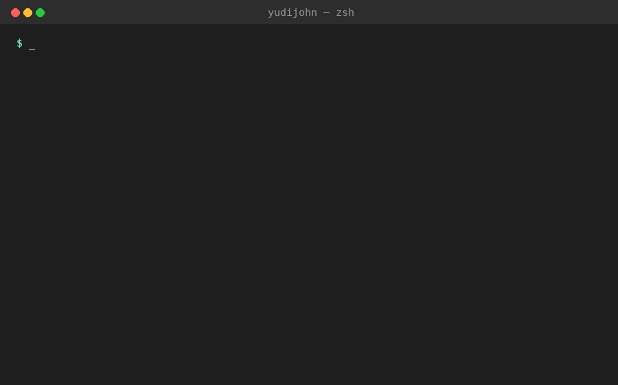

# next-cache-doctor

[](https://www.npmjs.com/package/next-cache-doctor)
[](https://github.com/yudijohn/next-cache-doctor/actions/workflows/ci.yml)
[](https://www.npmjs.com/package/next-cache-doctor)
[](https://github.com/yudijohn/next-cache-doctor/blob/main/LICENSE)

Static analysis CLI for Next.js's `'use cache'` directive (Next.js 15.2+ / 16 Cache Components).

Next.js 16 flipped caching from implicit to explicit: nothing is cached unless you opt in with `'use cache'`. That's great for control, but a few mistakes are easy to make and easy to miss in review:

1. Forgetting `cacheLife(...)`, so the cache duration silently falls back to a default profile instead of being explicit at the call site.
2. Calling `cookies()`, `headers()`, or reading `searchParams` **inside** a plain `'use cache'` scope — directly, *or indirectly through a helper function you call* — which can serve one user's cached data to a different user, because the cache key doesn't account for the request.
3. Forgetting `cacheTag(...)`, so the only way to invalidate the cache is waiting for it to expire — no on-demand `revalidateTag()`.

`next-cache-doctor` scans your codebase and flags all three, before they ship — and can auto-fix the easy case.

```
npx next-cache-doctor scan .
```

```
next-cache-doctor v0.1.0
Scanned 42 file(s), 6 contain a 'use cache' scope.

app/dashboard/page.tsx
   ERROR  L18  [possible-private-data-leak]
         "getUserDashboard" is cached with plain 'use cache' but calls getSession(),
         which internally calls cookies(). This can leak per-user data across users.
         Use 'use cache: private', or refactor to pass the value in as an argument
         instead.

app/products/actions.ts
   WARN   L4  [missing-cache-life]
         'use cache' scope "getProducts" has no explicit cacheLife(...). The default
         profile will apply implicitly - add cacheLife() to make the duration explicit
         at the call site.
   INFO   L4  [missing-cache-tag]
         'use cache' scope "getProducts" has no cacheTag(...). Without a tag you can
         only invalidate this cache by waiting for cacheLife to expire, not on-demand
         via revalidateTag().

1 error(s), 1 warning(s), 1 info across 2 file(s).
```



## Install

```
npm install --save-dev next-cache-doctor
```

Or run it without installing:

```
npx next-cache-doctor scan .
```

## Usage

```
next-cache-doctor scan [path]                # defaults to current directory
next-cache-doctor scan . --json              # machine-readable output for CI/tooling
next-cache-doctor scan . --fail-on warning   # also exit non-zero on warnings (default: error)
next-cache-doctor scan . --fix               # auto-insert cacheLife('minutes') where it's missing
```

Exit code is `1` if any error-level finding exists (or warning-level too, with `--fail-on warning`), so it works as a CI gate:

```yaml
# .github/workflows/ci.yml
- run: npx next-cache-doctor scan .
```

## Rules

| Rule | Severity | What it catches |
|---|---|---|
| `missing-cache-life` | warning | A `'use cache'` scope with no `cacheLife(...)` call, so the duration is left implicit. Auto-fixable with `--fix`. |
| `possible-private-data-leak` | error | A plain `'use cache'` scope (not `'use cache: private'`) that calls `cookies()`, `headers()`, or reads `searchParams` — directly, or through a same-file helper function it calls. |
| `missing-cache-tag` | info | A `'use cache'` scope with no `cacheTag(...)`, so it can only be invalidated by waiting for expiry, not on-demand. |

## `--fix`

Currently auto-fixes `missing-cache-life` by inserting a `cacheLife('minutes')` stub right after the directive. It's a starting point, not a final answer — always review the diff and pick the duration that actually fits your data:

```
npx next-cache-doctor scan . --fix
```

## How it works

`next-cache-doctor` parses each `.ts`/`.tsx` file with the TypeScript compiler API, finds functions/components/files whose body opens with a `'use cache'` directive prologue, and inspects each scope for the signals above. For the leak rule, it also builds a map of same-file top-level helper functions and recursively checks whether a function you call from inside a cache scope itself touches `cookies()`/`headers()`/`searchParams` — including through a chain of helpers (with cycle protection for mutual recursion). It does not execute your code and does not require your project to build.

## Known limitations (v0.1)

- Detection is name-based: it looks for calls to identifiers literally named `cacheLife`, `cacheTag`, `cookies`, `headers`. Re-exporting these under a different name will not be detected.
- Helper-function tracing only follows functions declared in the **same file**. A helper imported from another module is not traced yet.
- A helper function that itself opens its own `'use cache'`/`'use cache: private'` scope is treated as independently validated and is not traced into — which is correct, since it manages its own caching.
- `--fix` only handles the `missing-cache-life` case so far.

Contributions and bug reports are very welcome.

## Roadmap

- Trace helper functions across file/module boundaries, not just same-file
- `--fix` support for `missing-cache-tag` (insert a reasonable tag suggestion)
- VS Code extension / inline devtools overlay showing cache boundaries at dev time

## License

MIT
